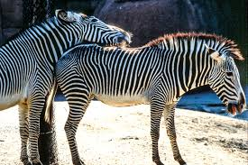

# Digital image processing

## Zooming of images
Code to implement zooming of images using Python and OpenCV.

### Input
* Path of the image.
* Pivot point coordinates ( x coordinate, y coordinate)
* Scale 

 ### Output
 A  zoomed image of the same size as the input image.
 
 ### Example
 #### Input
 Pivot point (x, y): (133, 72)   
 Scale: 2    
 Input image                                       
                   
 
Output   
 
 
 ### Execution
 To execute the code to zoom an image with given pivot coordinates and scale, run the following command:
 
python zooom.py  -i "Image_path" -p x,y -s 2

### Algorithm
1. Read input image  
2. Crop the region of interest around the pivot point (where to zoom) and scale as
parameters. 
    * Get the width and height of original image.  
    * New width = width / scale; New height = height/ scale  
    * x_Top left of cropped image= x_Top left of original image + New width/2, 
      y_Top left of cropped image= y_Top left of original image + New height/2  
    * The cropped image is the region of interest.  
3. Zoom the image by replicating the pixel values.  
   Replication method pseudocode:  
   * Take the pixel of the image  
   * For i in range(scale):  
     i. Copy the pixel value row wise  
    ii. Copy the pixel value column wise  
   iii. Copy the pixel value diagonal wise  
   
### Results

    
    
    
    
 
 
   
   
   *
